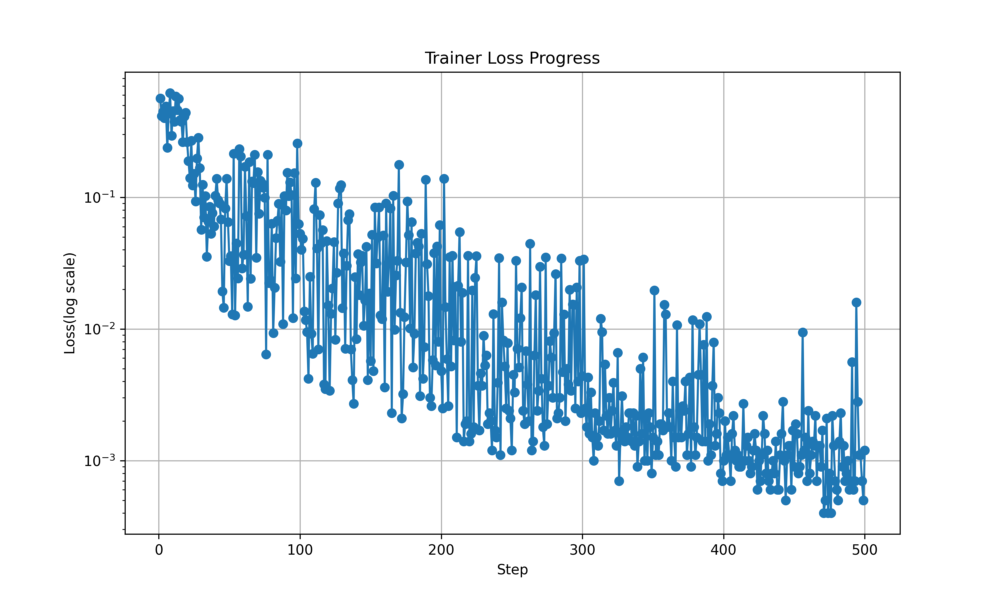
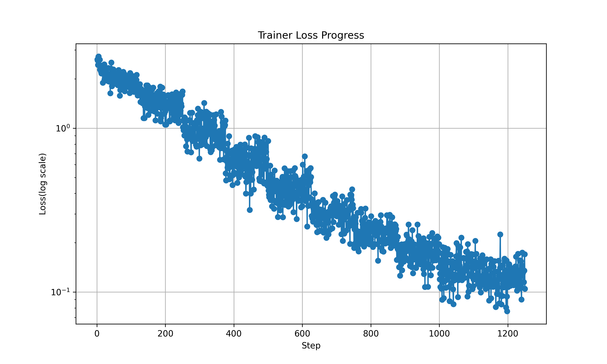

## System Configuration

1. OS: Ubuntu 22.04
2. GPUs: 2x 24GB NVIDIA Graphics Card (for deepspeed zero optimization)
3. RAM: > 32GB (for minicpm-v deepspeed offload)

## Installation

1. Create 3 virtual environments for MiniCPM-V, TinyLLaVA and Data Preprocessing
    ```bash
    python3 -m venv minicpmv_venv
    python3 -m venv tinyllava_venv
    python3 -m venv data_preprocessing_venv
    ```

2. Setup Data Preprocessing virtual environment
    ```bash
    source data_preprocessing_venv/bin/activate
    cd datasets
    pip install -r requirements.txt
    ```

3. Setup MiniCPM-V virtual environment
    - Install official dependencies
        ```bash
        source minicpmv_venv/bin/activate
        git clone https://github.com/OpenBMB/MiniCPM-V.git
        cd MiniCPM-V
        pip install -r requirements.txt
        ```

    - Copy all my modification file into MiniCPM-V finetune folder (only check on the commit `9bd93a2`)
        ```bash
        cp -r modification/minicpm/* MiniCPM-V/finetune/
        ```
    
    - Install my modification dependencies
        ```bash
        cd MiniCPM-V/finetune
        pip install -r requirements.txt
        ```

4. Setup TinyLLaVA virtual environment
    - Install official dependencies
        ```bash
        source tinyllava_venv/bin/activate
        git clone https://github.com/TinyLLaVA/TinyLLaVA_Factory.git
        cd TinyLLaVA_Factory
        pip install .
        pip install flash-attn --no-build-isolation
        ```
    
    - Copy all my modification file into TinyLLaVA training folder (only check on the commit `6c581c3`)
        ```bash
        cp -r modification/tinyllava/* TinyLLaVA_Factory/scripts/train
        ```

## Usage

### Data Preprocessing

There are few scripts files in the `datasets/scripts` folder for data preprocessing. There are few steps for data preprocessing:

#### Generate the synthetic data for finetuning

1. This script can generate the random synthetic images data (image with subtitle) from the images(with no subtitle) and sentences (subtitle) data.
    ```bash
    # Modify the `generate_synth_images.sh` file to set the correct path for the image folder and text file and the number of generated images.
    bash generate_synth_images.sh
    ```

#### Generate the dataset for MiniCPM-V or TinyLLaVA

1. This script can generate the json dataset for MiniCPM-V or TinyLLaVA.
    ```bash
    # Modify the `generate_json_datasets.sh` file to set the correct path for the model type, train rate, image folder, subtitle file, train dataset file, validation dataset file, and seed.
    bash generate_json_datasets.sh
    ```

### MiniCPM-V 

#### Brief Explanation for Modification File 

1. `finetune.py`: Add: Use `utf-8` to open json file.
2. `ds_config_zero3.json`: Modify: Use `cpu` to offload the model weight.
3. `finetune_lora.sh`: Modify: the path for my dataset and model saving path, and the number of GPUs, training steps, and batch size.
4. `merge.py`: Add: Merge the pretrained model and finetuned lora adapter.
5. `multi_gpu_inference.py`: Add: Inference with multiple GPUs for saving memory.
6. `cpu_inference.py`: Add: Inference with CPU for saving memory.

#### Finetuning

1. Modify the `finetune_lora.sh` file to set the correct path for the dataset and model saving path, and the number of GPUs, training steps, and batch size.
2. Run the `finetune_lora.sh` file to start the finetuning process.
    ```bash
    bash finetune_lora.sh
    ```

#### Inference

1. Because the model is too large, it cannot be loaded into the memory of a single 24GB GPU. Therefore, I provide two inference methods: `multi_gpu_inference.py` and `cpu_inference.py`.

2. If you have two 24GB GPUs, you can use the `multi_gpu_inference.py` file to inference the model. If is the fastest way to inference the model.
    ```bash
    # Modify the `multi_gpu_inference.py` file to set the correct path for the model and test dataset.
    python multi_gpu_inference.py
    ```
3. If you only have one 24GB GPU, you can use the `cpu_inference.py` file to inference the model. It is quite slower than the `multi_gpu_inference.py` file.
    ```bash
    # Modify the `cpu_inference.py` file to set the correct path for the model and test dataset.
    python cpu_inference.py
    ```

### TinyLLaVA

#### Brief Explanation for Modification File 

1. `custom_finetune.sh`: Modify the following config
    1. json dataset path
    2. train image folder
    3. lora adapter save path
    4. custom_fineturn.py absolute path
    5. deepspeed config path
    6. training epoch

2. `inference.py`: Add: Inference with LoRA adapter and TinyLLaVA pretrained model.

#### Finetuning

1. Modify the `custom_finetune.sh` file to set the correct path for the dataset and model saving path, and the number of GPUs, training steps, and batch size.
2. Run the `custom_finetune.sh` file to start the finetuning process.
    ```bash
    bash finetune_lora.sh
    ```

#### Inference

1. Modify the `inference.py` file to set the correct path for the model and test dataset.
2. Run the `inference.py` file to start the inference process.
    ```bash
    python inference.py
    ```

## Comparison

### MiniCPM-V

1. Dataset: 
    - 1000 synthetic images
    - Synthetic source: 144 images (31 imagenet, 3 teacher provided, 81 food related, 29 soldier related) and 1000 chinese sentences (generated by the gpt-4o)

2. Training Hyperparameters:
    - Batch Size: 1
    - Total Batch Size(gpus * gradient_accumulation_steps): 8
    - Learning Rate: 1e-6 
    - Training Steps: 500

3. Training Time: 8 hours

4. Training Loss Plot:
    

5. Kaggle Public Score(CER): 0.49

### TinyLLaVA

1. Dataset: 
    - 1000 synthetic images
    - Synthetic source: 144 images (31 imagenet, 3 teacher provided, 81 food related, 29 soldier related) and 1000 chinese sentences (generated by the gpt-4o)

2. Training Hyperparameters:
    - Batch Size: 4
    - Total Batch Size(gpus * gradient_accumulation_steps): 4
    - Training Epochs: 10

3. Training Time: 10 hours

4. Training Loss Plot:
    

5. Kaggle Public Score(CER): 10.52

### Conclusion

1. MiniCPM-V can fit the synthetic data and achieve a good performance on the Kaggle public score.
2. TinyLLaVA can fit the synthetic data but cannot achieve a good performance on the Kaggle public score. And it also looks like overfitting on the synthetic data.
3. MiniCPM-V is larger than TinyLLaVA, and also pretrain on the large chinese corpus. Therefore, MiniCPM-V already can have ability to watch chinese images, but TinyLLaVA cannot.
4. TinyLLaVA is smaller and memory efficient than MiniCPM-V. But it don't have the ability to learn the chinese subtitle images well.


## Reference

1. [MiniCPM-V Official Github](https://github.com/OpenBMB/MiniCPM-V)

2. [MiniCPM-V Official Demo](https://huggingface.co/spaces/openbmb/MiniCPM-Llama3-V-2_5)

2. [TinyLLaVA Official Github](https://github.com/TinyLLaVA/TinyLLaVA_Factory)