# NYCU-IASS-DL2024-Taiwanese-ASR

智能所 312581029 廖永誠

## Dataset

1. Train Dataset : 3123 Taiwaneses Speech Sentence
2. Test Dataset : 346 Noise Taiwaneses Speech Sentence

## Experiment Environment

1. Ubuntu 22.04
2. Python 3.10.12
3. CUDA 12.2
4. NVIDIA Graphics Card with 24GB Memory

## Task

### Task1: Espnet ASR

#### 1.1 First try with clean data

1. Configurations
    
    - asr_config: aishell/conf/asr_train_branchformer.yaml
    - token_type: word
    - batch_bins: 500000   (larger will cause GPU OOM)
    - learning_rate: 0.001
    - warmup_steps: 35000
    - epoch: 45

2. Training Progress

    - acc
        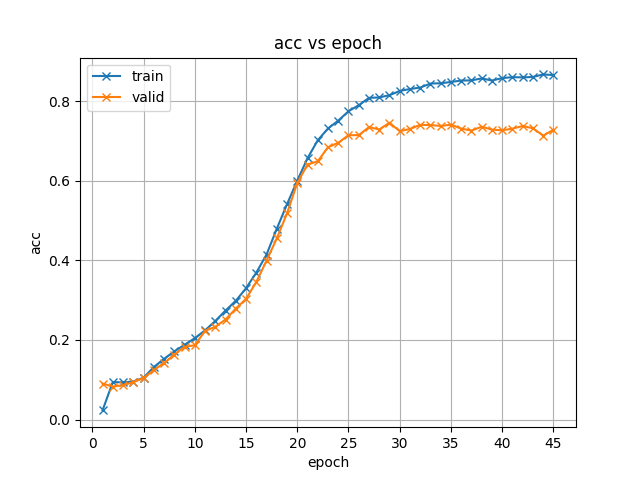
    - cer
        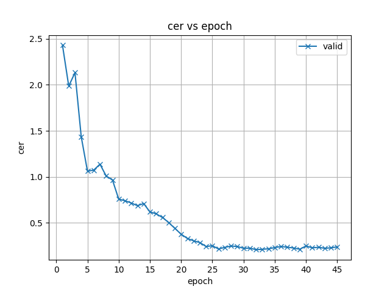
    - loss
        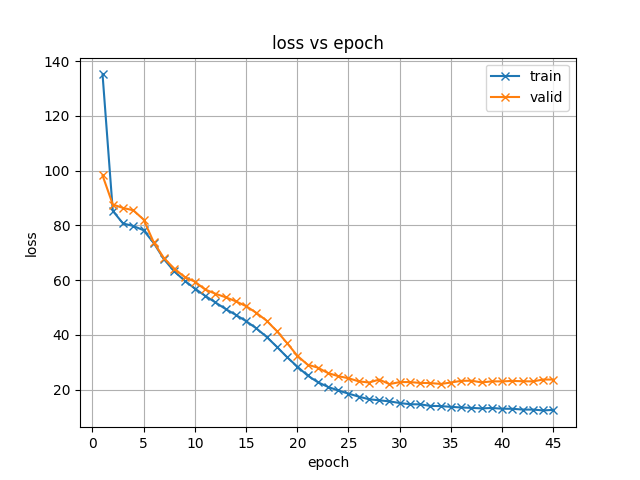

3. Public Leaderboard
    
    - WER: `0.75083`

4. Analysis

    - The model is fitting non noise data well, but the model is not robust to noise data.

#### 1.2 Try with noise data

1. Configurations
    
    - asr_config: aishell/conf/asr_train_branchformer.yaml
    - token_type: word
    - batch_bins: 200000
    - learning_rate: 0.0001
    - warmup_steps: 10000
    - epoch: 80
    - noise methods:
        ```python
        augment1 = naf.Sometimes([
        naa.VtlpAug(sampling_rate=16000, zone=(0.0, 1.0), coverage=1.0, factor=(0.9, 1.1)),
        ], aug_p=0.4)

        augment2 = Compose([
            AddGaussianSNR(min_snr_in_db=10, max_snr_in_db=30, p=0.2),
            TimeStretch(min_rate=0.8, max_rate=1.2, leave_length_unchanged=False, p=0.4),
            PitchShift(min_semitones=-4, max_semitones=4, p=0.4),
            AddBackgroundNoise(
                sounds_path='ESC-50',
                min_snr_in_db=10,
                max_snr_in_db=30.0,
                p=0.4),
            AddShortNoises(
                sounds_path='ESC-50',
                min_snr_in_db=10,
                max_snr_in_db=30.0,
                noise_rms="relative_to_whole_input",
                min_time_between_sounds=2.0,
                max_time_between_sounds=8.0,
                p=0.3),
            ApplyImpulseResponse(
                    ir_path='echo-thief', p=0.4
                )
        ])
        ```
        - [ESC-50 Datasets Link](https://github.com/karolpiczak/ESC-50)
        - [echo-thief Datasets Link](http://www.echothief.com/downloads/)

2. Training Progress

    - acc
        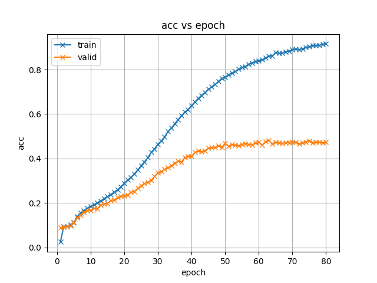
    - cer
        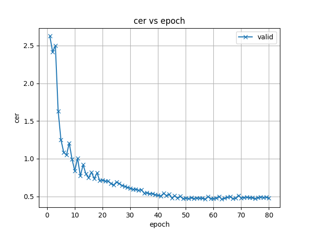
    - loss
        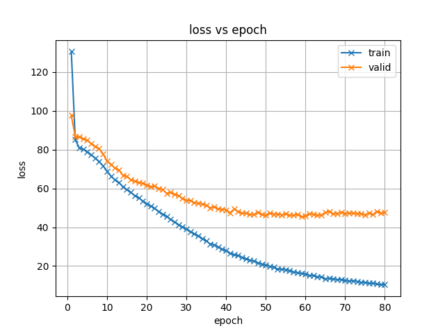

3. Public Leaderboard
    
    - WER: `0.43819`

4. Analysis

    - The model is not fitting noise data well, because even the model can reduce training loss, the validation loss is still high.
    - But on the test data, the model is more robust than not training with noise data.
    - Maybe the model is overfitting the noise data, so the i trying to reduce the noise data augmentation.

#### 1.3 Try with less noise data (no TimeStretch, BackgroundNoise, ShortNoises, ImpulseResponse)

1. Configurations
    
    - asr_config: aishell/conf/asr_train_branchformer.yaml
    - token_type: word
    - batch_bins: 500000
    - learning_rate: 0.001
    - warmup_steps: 35000
    - epoch: 45
    - noise methods:
        ```python
        augment1 = naf.Sometimes([
        naa.VtlpAug(sampling_rate=16000, zone=(0.0, 1.0), coverage=1.0, factor=(0.9, 1.1)),
        ], aug_p=0.4)

        augment2 = Compose([
            AddGaussianSNR(min_snr_in_db=10, max_snr_in_db=30, p=0.2),
            PitchShift(min_semitones=-4, max_semitones=4, p=0.4),
        ])
        ```

2. Training Progress

    - acc
        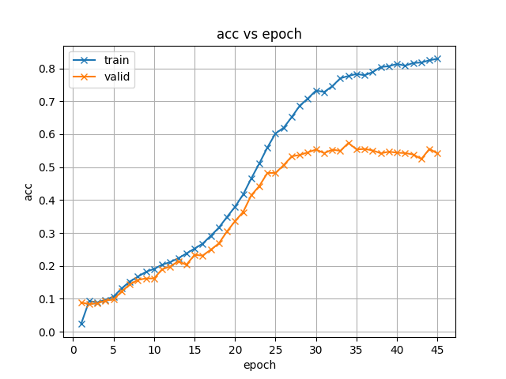
    - cer
        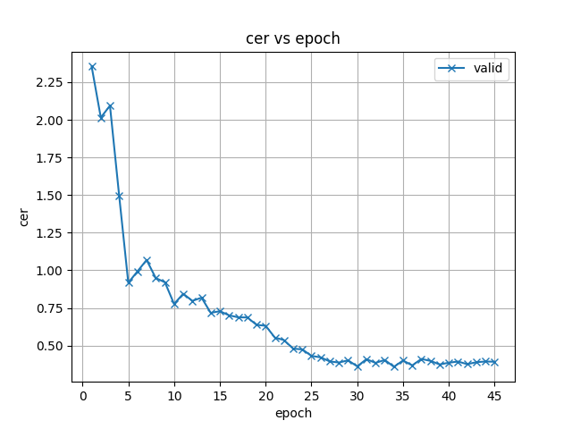
    - loss
        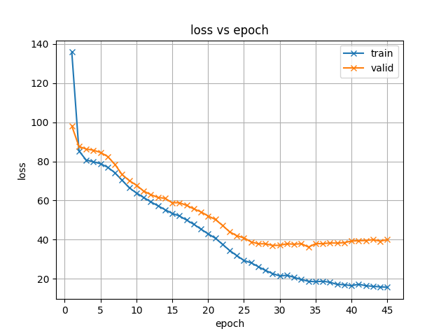

3. Public Leaderboard
    
    - WER: `0.42006`

4. Analysis

    - The model can win the previous model a little bit, but the model is still overfitting the noise data.
    - The model can fitting valid noise data better than the previous dataset, but still not robust enough.
    - Thinking about maybe the token type(word) is hard to fit the data, so i try to use char token type.

#### 1.4 Try with char token type

1. Configurations
    
    - asr_config: aishell/conf/asr_train_branchformer.yaml
    - token_type: char
    - batch_bins: 200000
    - gradient_accumulation_steps: 5
    - learning_rate: 0.001
    - warmup_steps: 35000
    - epoch: 200
    - noise methods: same as 1.2

2. Training Progress

    - acc
        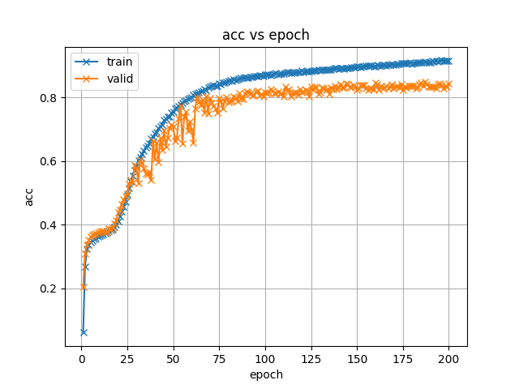
    - cer
        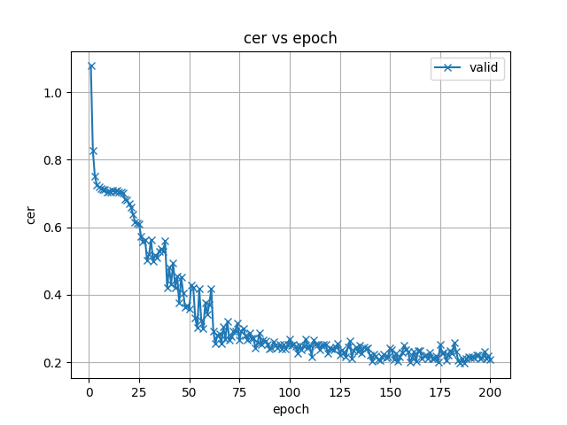
    - loss
        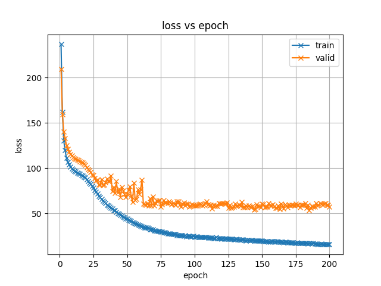

3. Public Leaderboard
    
    - WER: `0.29446`

4. Analysis

    - The model can better fitting the noise data on both training and validation data.
    - And the model can be more robust on the test data.
    - Thinking about maybe train the model from scratch is one of the reasons can't deal with noise data well, so i try to use the pre-trained model.

### Task2: Espnet ASR + S3PRL Frontend

#### 2.1 Try with pre-trained model (hubert_base)

1. Configurations
    
    - asr_config: egs2/librispeech/asr1/conf/tuning/train_asr_conformer7.yaml
    - token_type: char
    - batch_bins: 200000
    - gradient_accumulation_steps: 5
    - learning_rate: 0.0025
    - warmup_steps: 40000
    - epoch: 120
    - noise methods: same as 1.2

2. Training Progress

    - acc
        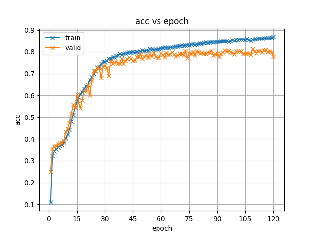
    - cer
        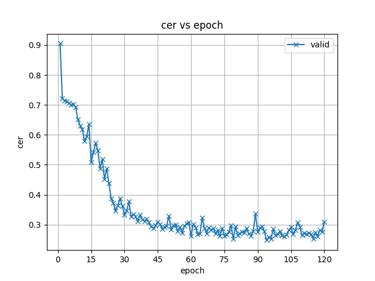
    - loss
        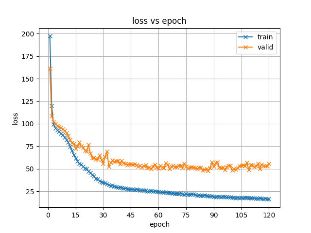

3. Public Leaderboard
    
    - WER: `0.47249`

4. Analysis

    - The model can have similar performance with the previous branchformer model.
    - But Need more GPU and time to train the model because the model is larger than the previous model.
    - In theorey, the pretrained front-end model can help the model to fitting the noise data even the training corpus is small.
    - But the result is not as good as expected.
    - Maybe Trying larger pre-trained model like `hubert_large_ll60k`, `wav2vec2_large_960`, `wavlm_large`.

### Task3: Huggingface OpenAI Whisper Fine-tuning

#### 3.1 Try with Whisper-Medium

1. Motivation

    - In the previous Espnet ASR + S3PRL Frontend model, the model can't fitting the test noise data well, but need a lot of time to preprocess and train the model.
    - So i try to use Huggingface to fine-tuning the OpenAI Whisper model, switching from `frontend pretrained model + ASR` model to `end-to-end pretrained` model.

2. Configurations
    
    - model: OpenAI/whisper-medium
    - token_type: char
    - batch_size: 16
    - learning_rate: 1e-5
    - warmup_steps: 500
    - epoch: 30
    - noise methods: same as 1.2
    - memory_efficient: 
        1. enable fp16 training (Mixed Precision Training)
        2. gradient_checkpointing (Reduce activation memory usage)

3. Training Progress

    - wer
        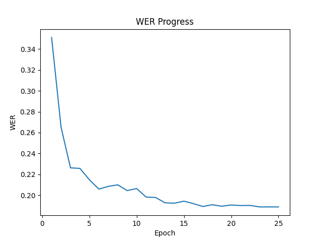

4. Public Leaderboard
    
    - WER: `0.15080`

5. Analysis

    - The model can fitting the noise data well, and the model is robust on the test data.
    - The model can have better performance than the previous models.
    - The model parameters are larger than the previous models (`769M`), but it only need few epochs to train the model.
    - With some memory efficient technique, it can be trained on a single GPU with 24GB memory.
    - Currently, i only enable the `fp16 training` and `gradient checkpointing`, there stll are more memory efficient techniques can be used.
        1. further reduce the batch size (currently `16`)
        2. `deepspeed` zero offload (use CPU memory to store the model parameters) [deepspeed integration](https://github.com/huggingface/community-events/tree/main/whisper-fine-tuning-event#deepspeed)
        3. `deepspeed` zero infinity offload (use NVMe SSD to store the model parameters) [deepspeed integration](https://github.com/huggingface/community-events/tree/main/whisper-fine-tuning-event#deepspeed)
        2. `bitsandbytes` 8bit optimizer (turn optimizer states like momentum and variance from 32 bits to 8bits) [bitsandbytes 8bit optimizer integration](https://github.com/huggingface/community-events/tree/main/whisper-fine-tuning-event#adam-8bit)


