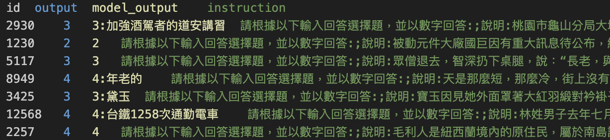

# NYCU-IASS-DL2024-Taiwanese-ASR

智能所 312581029 廖永誠

## Dataset

1. Train Dataset : 13550 Question and Answer Pair
2. Test Dataset : 1000 Question

## Experiment Environment

1. Ubuntu 22.04
2. Python 3.10.12
3. CUDA 12.2
4. NVIDIA Graphics Card with 24GB Memory

## Pre-trained Model

1. Llama based

    - meta-llama/Meta-Llama-3-8B-Instruct
    - yentinglin/Taiwan-LLM-7B-v2.1-chat
    - taide/TAIDE-LX-7B-Chat
    - taide/Llama3-TAIDE-LX-8B-Chat-Alpha1

3. Mistral based

    - mistralai/Mistral-7B-Instruct-v0.2
    - MediaTek-Research/Breeze-7B-Instruct-v1_0

4. Gemma based
    
    - google/gemma-1.1-7b-it

## Zero shot evluation

1. Before fine-tuning the model, I first evaluate the model with the zero shot prompting.

2. Sample 50 question and use the Instruction Fine-tuned model to generate the answer.

    

3. The result shows that the model can generate the answer with the zero shot prompting.

    | Model Type | Model Name | Sample 50 Acc |
    |------------|------------|--------|
    | Mistral based | MediaTek-Research/Breeze-7B-Instruct-v1_0 | 90 |
    | Gemma based | google/gemma-1.1-7b-it | 88 |
    | llama3 based | meta-llama/Meta-Llama-3-8B-Instruct | 82 |
    | Mistral based | mistralai/Mistral-7B-Instruct-v0.2 | 72 |
    | llama2 based | yentinglin/Taiwan-LLM-7B-v2.1-chat | 54 |
    | llama3 based | taide/Llama3-TAIDE-LX-8B-Chat-Alpha1 | 52 |

4. The result also shows that our fine-tuned purpose is to allow model can generate the answer in the correct template. Not to training the model to generate full prompt text.

## Data Preprocessing

1. Because i fine-tuned the Instruction fine-tuned model not the base model, so I need to preprocess the data to fit the model chat template.

2. For example (Breeze model): 
    - test template: `<s>SYS_PROMPT  [INST] QUERY1 [/INST] RESPONSE1 [INST] QUERY2 [/INST]`
    - train & validation template: `<s>SYS_PROMPT  [INST] QUERY1 [/INST] RESPONSE1 [INST] QUERY2 [/INST] ANSWER </s>`

## Fine-tuning

### Supervised fine-tuning
1. When training a Language Model, we provide the complete text
2. convert it to a sequence of tokens, apply a causal mask to the input tokens, and the model generates the probability of the next token for each input token. 
3. The loss is calculated using cross-entropy loss. 
4. Therefore, the objective of the model is to minimize the next token prediction loss for all input tokens.

### Different fine-tuning strategies in our dataset

1. Full text fine-tuning

    - The model is trained with the full text of the training text.
    - For example (Breeze model): 
        - The model will try to minimize loss of all token output in following sequence: `<s>SYS_PROMPT  [INST] QUERY1 [/INST] RESPONSE1 [INST] QUERY2 [/INST] ANSWER </s>`

2. Completion only fine-tuning

    - The model is trained with the completion text of the training text.
    - For example (Breeze model): 
        - The model will try to minimize loss of all token output in following sequence: `ANSWER </s>`

### Training Configuration

1. Using `transformers` library to fine-tune the model.

2. Activate `fp16` and `lora` to reduce the memory usage.

3. Configuration detail:

    | Parameter | Value |
    |-----------|-------|
    | LORA_ALPHA | 128 |
    | LORA_DROPOUT | 0.1 |
    | LORA_RANK | 64 |
    | MAX_SEQ_LENGTH | 4096 |
    | TRAIN_BATCH_SIZE | 1 |
    | GRADIENT_ACCUMULATION_STEPS | 16 |
    | WARMUP_STEPS | 700 |
    | LEARNING_RATE | 1e-4 |
    | WEIGHT_DECAY | 0.01 |
    | NUM_TRAIN_EPOCHS | 3 |

### Compare the performance of different fine-tuning strategies

1. Full text fine-tuning

    - Pre-trained model: MediaTek-Research/Breeze-7B-Instruct-v1_0
    - Public score: `0.81`

2. Completion only fine-tuning

    - Pre-trained model: MediaTek-Research/Breeze-7B-Instruct-v1_0
    - Public score: `0.89666`

3. Analysis

    - Using full text fine-tuning will have larger loss, which may cause the model not optimize the completion part.
    - The model already has the ability to generate the answer with the zero shot prompting, so the completion only fine-tuning can better focus to train the model to generate the answer in the correct template.

### Compare the performance of different models

1. Comparison

    | Model Name | Valid Score | Public Score | Private Score | Total Score |
    |------------|-------------|--------------|---------------|-------------|
    | TAIDE_Llama3 | 0.9535 | 0.86333 | 0.90285 | 0.890994 |
    | Breeze 3 epoch | 0.94 | 0.89 | 0.89142 | 0.890994 |
    | Llama3 | 0.939 | 0.8433 | 0.89285 | 0.877985 |
    | Gemma | 0.93 | 0.82 | 0.85857 | 0.846999 |
    | Taiwan LLM | 0.928 | 0.84666 | 0.84571 | 0.845995 |
    | TAIDE | 0.92 | 0.79 | 0.79714 | 0.794998 |
    | Mistral | 0.8915 | 0.73333 | 0.75857 | 0.750998 |

2. Analysis

    - Chinese model can improve the performance of the english original model.
    - Llama3's model is stronger than other model's family.

### Further improvement by voting

1. After i have multiple fine-tuned models, I use the voting strategy to improve the performance.

2. The voting strategy is i will give the weight to each model based on the performance of the model.

3. The final decision is based on the weighted sum of the different model's decision.

4. Configuration

    | Model Name | Weight |
    |------------|--------|
    | TAIDE_Llama3 | 0.890994 |
    | Breeze 3 epoch | 0.890994 |
    | Breeze 5 epoch | 0.858999 |
    | Llama3 | 0.877985 |
    | Gemma | 0.846999 |
    | Taiwan LLM | 0.845995 |

5. Performance

    - Public score: `0.92666`
    - Private score: `0.92571`

## Conclusion

1. Choose the completion only fine-tuning strategy.
    - The model already has the ability to generate the answer with the zero shot prompting, so the completion only fine-tuning can better focus to train the model to generate the answer in the correct template.
2. Choose the strongest pretrained model to fine-tune.
    - Llama3's model is stronger than other model's family.
    - Chinese model can improve the performance of the english original model.